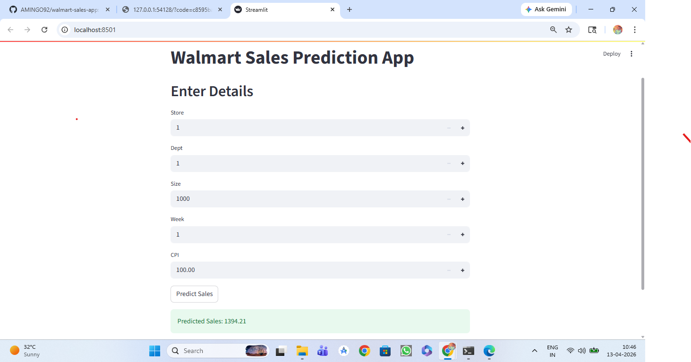

# 🛒 Walmart Sales Prediction App

## 📌 Project Overview
This project predicts Walmart weekly sales using Machine Learning.  
It analyzes historical sales data and various factors like CPI, fuel price, holidays, and markdowns to forecast future sales.

---

## 🚀 Features
- Predict weekly sales using ML model
- User-friendly Streamlit web app
- Real-time input (CPI, Fuel Price, Holidays, etc.)
- Accurate regression-based prediction

---

## 🛠️ Tech Stack
- Python
- Pandas, NumPy
- Scikit-learn
- Streamlit
- Matplotlib / Seaborn

---

## 📊 Dataset
- Walmart Store Sales Dataset
- Includes:
  - Store
  - Date
  - Weekly Sales
  - CPI
  - Fuel Price
  - MarkDowns
  - Holiday Flag

---

## ⚙️ How to Run

```bash
pip install -r requirements.txt
streamlit run app.py


## 📸 Output Screenshot

